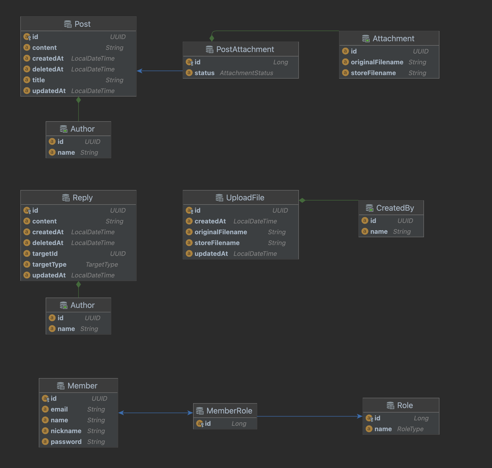

# 프로젝트 설명

## 프로젝트 구조

```
src
├── docs
│   └── image
├── main
│   ├── java
│   │   └── org
│   │       └── example
│   │           └── community
│   │               ├── common
│   │               │   ├── exception
│   │               │   ├── page
│   │               │   ├── security
│   │               │   └── util
│   │               ├── config
│   │               └── domain
│   │                   ├── auth
│   │                   │   ├── api
│   │                   │   │   ├── docs
│   │                   │   │   ├── request
│   │                   │   │   └── response
│   │                   │   ├── application
│   │                   │   │   ├── command
│   │                   │   │   └── query
│   │                   │   └── domain
│   │                   ├── file
│   │                   │   ├── api
│   │                   │   │   └── docs
│   │                   │   ├── application
│   │                   │   ├── domain
│   │                   │   └── infra
│   │                   ├── post
│   │                   │   ├── api
│   │                   │   │   ├── docs
│   │                   │   │   ├── request
│   │                   │   │   └── response
│   │                   │   ├── application
│   │                   │   │   ├── command
│   │                   │   │   │   └── dto
│   │                   │   │   └── query
│   │                   │   │       └── dto
│   │                   │   └── domain
│   │                   └── reply
│   │                       ├── api
│   │                       │   ├── docs
│   │                       │   └── request
│   │                       ├── application
│   │                       │   ├── command
│   │                       │   └── query
│   │                       └── domain
│   └── resources
│       ├── static
│       └── templates
└── test
```


### 도메인

#### auth
인증 및 권한, 회원 관리를 담당합니다.

`Member`와 `Role`을 직접 연관관계를 맺지 않고, 연결 엔티티(`MemberRole`)을 두어 확장성을 고려하였습니다.
예를 들어, USER 권한을 가진 A라는 회원이 Q&A 게시판에 접근 가능할 수 있다고 가정할 때, 신고로 인해 게시글 등록이 제한되는 상황이 발생할 수 있습니다.
이런 세부적인 권한 로직을 `MemberRole`에 추가하여 유연하게 관리할 수 있습니다.

#### post
게시글(첨부파일) 관리를 담당합니다.

현재 `Post`와 `PostAttachment`는 다대일(N:1) 관계로, `Post`는 `PostAttachment`를 알지 못하도록 설계되었습니다.
`Post`와 `PostAttachment`를 일대다(1:N) 관계로 설정할 경우, 조회 시 N+1 문제가 발생하고 이를 해결하기 위해 페치 조인을 사용할 경우 목록 조회 시 페이징 처리가 불가능한 이슈가 있습니다.

다대일(N:1) 관계로도 충분히 구현할 수 있는 상황에서, 불필요하게 일대다(1:N)로 복잡도를 높이는 것이 과연 필요할지 고민되었습니다.
한편으로는 DDD(도메인 주도 설계) 관점에서는 `Post`가 루트 애그리거트이므로, `PostAttachment`가 `Post`에 포함되는 것이 올바른 설계라는 생각도 들었습니다.

이 부분은 아직도 고민되는 부분인데 어떠한 방법이 좋을지는 추후 요구사항을 추가해 나가면서 생각할 예정입니다.

#### reply
답글 관리를 담당합니다.

처음 설계할 때는 `Post`와 `Reply`를 일대 다(1:N) 관계로 직접 맺으려고 했습니다. 하지만 몇 가지 이유로 분리하는 것이 더 적절하다고 판단했습니다.

첫번째는 생명주기의 차이 입니다. 게시글의 등록 및 수정은 답글에 영향을 미치지 않습니다. 게시글이 삭제될 경우, 연관된 답글도 함께 삭제해야 하지만, 이는 별도로 처리하면 된다고 생각했습니다.

두번째는 확장성을 고려하면 분리하는게 좋다고 판단했습니다. 현재는 Q&A 게시판에서만 답글이 사용되지만, 추후 다른 유형의 커뮤니티 도메인에서도 해당 도메인이 필요할 가능성이 있습니다. 
이 경우, 별도로 답글 기능을 다시 개발하는 것보다 기존 Reply 도메인을 활용하는 것이 유리합니다.

이러한 이유로 `Reply`를 독립적인 도메인으로 설계하여 확장성과 유연성을 확보했습니다.

#### file
파일 스토리지와 메타데이터 관리를 담당합니다.

게시글에 첨부파일을 등록할 때, 파일은 게시글 등록 전에 비동기적으로 업로드되는 방식이 일반적입니다.
물론, 게시글과 파일을 한 번에 업로드할 수도 있지만, 이 경우 다음과 같은 문제가 발생할 수 있습니다.
- 파일 업로드 시간이 게시글 등록 시간에 추가적으로 반영됨
- 파일 업로드 실패 시, 게시글 등록도 함께 실패하는 문제 발생

이러한 이유로 파일과 관련된 문제를 별도로 처리하는 파일 도메인을 만들었습니다. 
이를 통해 게시글 등록 과정에서 파일을 미리 업로드할 수 있으며, 게시글 외에도 회원의 프로필 사진 업로드 같은 다양한 기능에서 동일한 파일 업로드 로직을 재사용할 수 있습니다.

추가로 현재 로컬 파일 스토리지에 파일을 저장하고 있지만, 나중에 S3와 같은 다른 스토리지를 사용할 가능성을 고려하여 `FileStorage`라는 인터페이스를 정의해두었습니다. 
이를 통해 스토리지 구현을 유연하게 변경할 수 있습니다.

### 공통

### 인증/인가 과정
로그인 시, 처음에는 기본적인 폼 방식을 고려했으나, REST API의 특성에 맞춰 Stateless한 JWT 인증 방식을 채택했습니다.

1. `로그인 요청`: 클라이언트가 이메일과 비밀번호를 포함한 로그인 요청을 보내면, 서버는 이를 검증합니다.
2. `JWT 생성 및 반환`: 인증 성공 시, 서버는 JWT를 생성하여 클라이언트에 반환합니다.
3. `토큰 포함 요청`: 클라이언트는 이후 모든 요청에 Authorization 헤더에 JWT를 포함시켜 인증을 요청합니다.
4. `토큰 검증`: 서버는 요청에서 JWT를 추출하고, 유효한 토큰인지 확인한 후, 필요한 권한이 있는지 검증합니다.


### 예외 처리
예외 처리는 `GlobalExceptionHandler`를 통해 일관되게 관리합니다. 
에러 응답은 `ErrorResponse`라는 공통 규격을 따르며, 각 응답에는 HTTP 상태 코드, 에러 메시지, 그리고 필드 관련 구체적인 에러 이유를 담은 `FieldError`가 포함됩니다. 


## 발생한 이슈 및 해결 방법

개발 과정에서 권한(Role) 체크 시 트랜잭션 없이 접근하려다 Lazy 로딩으로 인해 프록시 객체가 반환되어 인증이 제대로 수행되지 않는 이슈가 있었습니다.
이를 해결하기 위해 페치 조인(Fetch Join)을 사용하여 필요한 데이터를 한 번에 가져오도록 개선하였습니다.


## 테이블 정의서(ERD)


## 엔티티 관계 다이어그램



